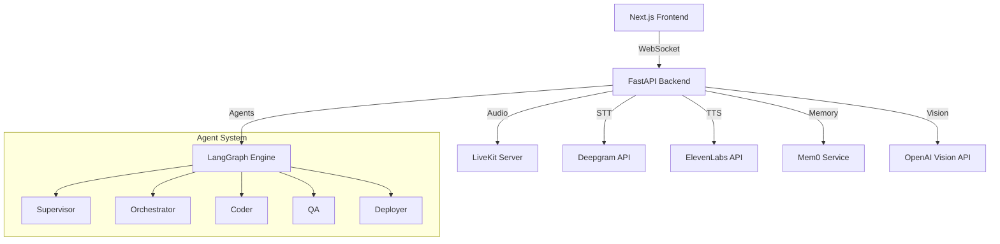

# LiveKit LangGraph Voice Agent

A sophisticated AI voice agent system built with LiveKit for real-time communication, LangGraph for intelligent agent orchestration, and modern web technologies for a seamless user experience.

## 🌟 Features

### Core Capabilities
- **Real-time Voice Conversation**: Crystal-clear audio with LiveKit WebRTC technology
- **Multi-Agent Intelligence**: LangGraph-powered agent system with specialized roles:
  - **Supervisor**: Environment validation, constraint enforcement, telephony approval
  - **Orchestrator**: Session lifecycle management and audio pipeline orchestration
  - **Coder**: Code generation with unified diffs and proper citations
  - **QA**: Comprehensive testing and validation with pass/fail reporting
  - **Deployer**: Docker and cloud deployment automation

### Advanced Features
- **Vision Processing**: Upload and analyze images with AI-powered descriptions
- **Persistent Memory**: Mem0 integration for context retention across sessions
- **Speech Processing**: 
  - Deepgram for high-accuracy speech-to-text
  - ElevenLabs for natural text-to-speech synthesis
- **Telephony Support**: SIP ingress and Twilio bridge for phone integration
- **Real-time Communication**: WebSocket-based bidirectional messaging

## 🏗️ Architecture



## 🚀 Quick Start

### Prerequisites
- **Python 3.11+** for backend
- **Node.js 18+** for frontend
- **Docker & Docker Compose** for containerized deployment
- **PowerShell** for Windows automation scripts

### 1. Environment Setup

Clone and configure:
```bash
git clone <repository-url>
cd livekit-langgraph-agent
```

Copy environment templates:
```bash
# Backend configuration
cp backend/.env.example backend/.env

# Frontend configuration
cp frontend/.env.example frontend/.env.local
```

Edit the `.env` files with your API keys:
```env
# Required for basic functionality
LIVEKIT_URL=wss://your-livekit-host
LIVEKIT_API_KEY=your_key_here
LIVEKIT_API_SECRET=your_secret_here
DEEPGRAM_API_KEY=your_key_here
ELEVENLABS_API_KEY=your_key_here

# Optional but recommended
OPENAI_API_KEY=your_key_here  # For vision processing
MEM0_API_KEY=your_key_here    # For remote memory storage
```

### 2. Development Setup

#### Backend (Python)
```powershell
cd backend
.\scripts\setup.ps1
.\scripts\run-local.ps1
```

#### Frontend (Node.js)
```bash
cd frontend
npm install
npm run dev
```

### 3. Docker Deployment
```bash
# Full stack with Docker Compose
docker-compose -f infra/docker-compose.yml up --build

# Or with specific profiles
docker-compose -f infra/docker-compose.yml --profile monitoring up
```

### 4. Cloud Deployment

#### Render (Backend)
1. Connect your GitHub repository to Render
2. Create a new Web Service using `backend/Dockerfile`
3. Set environment variables via Render dashboard
4. Deploy with `render.yaml` configuration

#### Vercel (Frontend)  
1. Install Vercel CLI: `npm i -g vercel`
2. Deploy: `vercel --prod`
3. Configure environment variables in Vercel dashboard

## 📋 API Documentation

Once running, access interactive API documentation at:
- **Local**: http://localhost:8000/docs
- **Health Check**: http://localhost:8000/health
- **Frontend**: http://localhost:3000

### Key Endpoints

| Endpoint | Method | Description |
|----------|--------|-------------|
| `/health` | GET | System health status |
| `/token` | POST | Generate LiveKit access token |
| `/vision` | POST | Analyze images with AI |
| `/stats` | GET | System statistics |
| `/events` | WebSocket | Real-time communication |

## 🧪 Testing

### Backend Tests
```powershell
cd backend
.\scripts\test.ps1

# With coverage
.\scripts\test.ps1 -Coverage

# Specific test pattern
.\scripts\test.ps1 -Pattern "test_agent*"
```

### Frontend Tests
```bash
cd frontend
npm test

# Watch mode
npm run test:watch

# With coverage
npm run test:coverage
```

## 🔧 Configuration

### Backend Configuration

Key environment variables:

```env
# Core Services
LIVEKIT_URL=wss://your-livekit-host
DEEPGRAM_API_KEY=your_key_here
ELEVENLABS_API_KEY=your_key_here

# Features
ENABLE_VISION=true
ENABLE_TELEPHONY=false

# Memory
MEM0_PROJECT=agentic-os
MEM0_STORE=local  # or 'remote'

# Server
PORT=8000
LOG_LEVEL=INFO
```

### Frontend Configuration

```env
NEXT_PUBLIC_API_BASE=http://localhost:8000
NEXT_PUBLIC_LIVEKIT_URL=wss://your-livekit-host
NEXT_PUBLIC_DEFAULT_ROOM=agent-room
NEXT_PUBLIC_DARK_MODE=true
```

## 📁 Project Structure

```
livekit-langgraph-agent/
├── prompts/                 # Agent prompt definitions
│   ├── supervisor.md
│   ├── orchestrator.md
│   ├── coder.md
│   ├── qa.md
│   └── deployer.md
├── backend/                 # Python FastAPI backend
│   ├── agents/             # LangGraph agent implementations
│   ├── tools/              # Integration tools (LiveKit, Deepgram, etc.)
│   ├── tests/              # Backend tests
│   ├── scripts/            # PowerShell automation scripts
│   └── app.py              # FastAPI application
├── frontend/               # Next.js React frontend
│   ├── app/                # Next.js App Router pages
│   ├── components/         # React components
│   ├── lib/                # Utilities and API client
│   └── tests/              # Frontend tests
├── infra/                  # Infrastructure configuration
│   ├── docker-compose.yml  # Local development stack
│   ├── render.yaml         # Render deployment config
│   └── vercel.json         # Vercel deployment config
└── logs/                   # Application logs
```

## 🔒 Security Considerations

- **API Keys**: Never commit API keys to version control
- **CORS**: Configure appropriate origins for production
- **Rate Limiting**: Implement rate limiting for public APIs  
- **Authentication**: Add user authentication for production use
- **HTTPS**: Use HTTPS in production environments
- **Environment Variables**: Use secure environment variable storage

## 🐛 Troubleshooting

### Common Issues

**Backend won't start**
- Verify Python 3.11+ is installed
- Check that all API keys are set in `.env`
- Run `.\scripts\setup.ps1` to ensure dependencies are installed

**Frontend build fails**
- Ensure Node.js 18+ is installed
- Check that `NEXT_PUBLIC_*` environment variables are set
- Clear Next.js cache: `rm -rf .next`

**LiveKit connection issues**
- Verify `LIVEKIT_URL` is accessible
- Check that API key and secret are correct
- Ensure WebSocket connections are not blocked by firewall

**Audio not working**
- Grant microphone permissions in browser
- Check that Deepgram API key is valid
- Verify ElevenLabs API key and voice ID

### Health Checks

Monitor system health via:
- **Backend**: http://localhost:8000/health
- **Docker**: `docker-compose ps` for container status
- **Logs**: Check `logs/` directory or container logs

## 🤝 Contributing

1. Fork the repository
2. Create a feature branch: `git checkout -b feature/amazing-feature`
3. Make your changes following the established patterns
4. Add tests for new functionality
5. Run the test suite: `.\scripts\test.ps1` (backend) and `npm test` (frontend)
6. Commit your changes: `git commit -m 'Add amazing feature'`
7. Push to the branch: `git push origin feature/amazing-feature`
8. Open a Pull Request

## 📄 License

This project is licensed under the MIT License - see the [LICENSE](LICENSE) file for details.

## 🙏 Acknowledgments

- **[LiveKit](https://livekit.io)** - Real-time communication infrastructure
- **[LangGraph](https://github.com/langchain-ai/langgraph)** - Agent workflow orchestration
- **[Deepgram](https://deepgram.com)** - Speech-to-text processing
- **[ElevenLabs](https://elevenlabs.io)** - Text-to-speech synthesis
- **[Mem0](https://mem0.ai)** - Persistent memory for AI agents
- **[Next.js](https://nextjs.org)** - React framework for frontend
- **[FastAPI](https://fastapi.tiangolo.com)** - Modern Python web framework

---

**Built with ❤️ for the future of conversational AI**